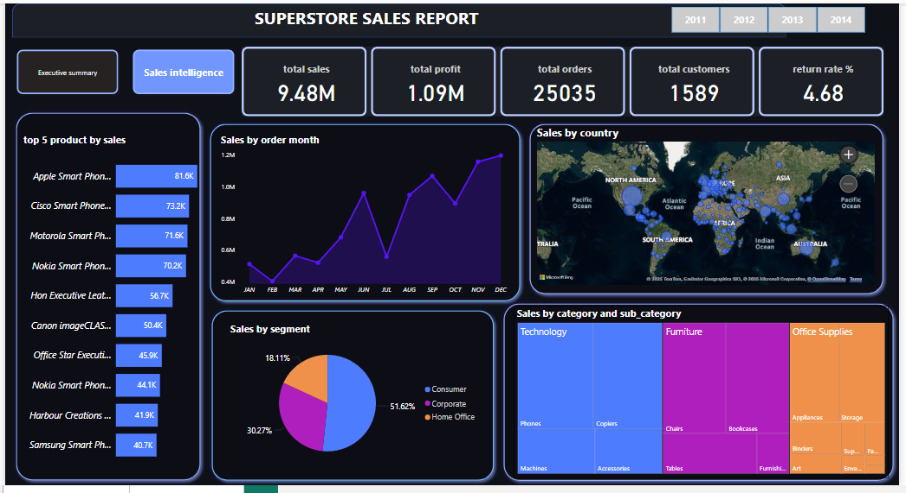
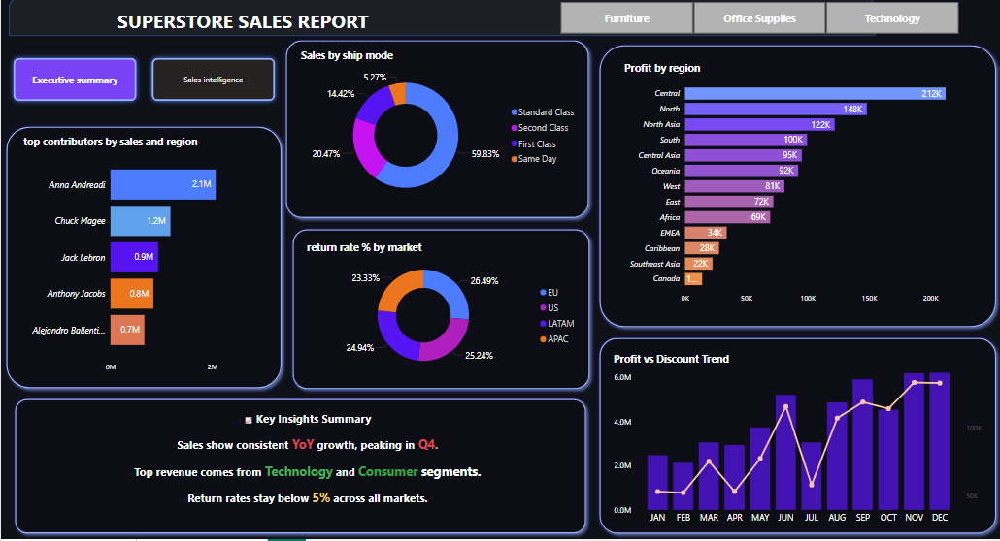

# Superstore Sales Dashboard 📊

Power BI dashboard project analyzing global sales trends using SQL and DAX.

---

## 🔍 Key Insights

- Sales consistently increased YoY, with peak in **Q4**
- **Technology** and **Consumer** segments generated the most revenue
- **Profit by Region** highlights strong markets
- **Return rates** stayed below 5% across markets
- Identified **Negative Profit Orders** for improvement
- Top 10 Products bt sales

---

## 🔁 Workflow Steps

1. ✅ Data Cleaning in Excel
2. ✅ Data Normalization using SQL (Star Schema)
3. ✅ Data Import into MySQL
4. ✅ SQL Queries for KPIs and trends
5. ✅ Dashboard Design in Power BI (2 Pages)
6. ✅ Project Publishing on GitHub

---

## 📷 Dashboard Previews

### 📌 Page 1 – Executive Summary  

### 📌 Page 2 – Sales Intelligence  

---

## 📁 Files Included

- `sales_analysis_dashboard.pbix` – Power BI report
- `orders_cleaned.csv` – Cleaned source dataset
- `Data preparation and modeling.sql.sql` – SQL normalization
- `Sales Insights Queries.sql.sql` – SQL queries for insights
- `Dashboard_page1.png`, `Dashboard_page2.png` – Report snapshots

---

## 👤 Author

**Aarthi V.**  
Aspiring Data Analyst | SQL • Power BI • Excel  
🔗 [LinkedIn Profile](https://www.linkedin.com/in/aarthi-v-9178a0248/)  
📂 [GitHub Repository](https://github.com/aarthi-dataanalyst/superstore-sales-dashboard)

---

## 📄 License

This project is for educational/portfolio use only. Dataset from Global Superstore (Kaggle).
